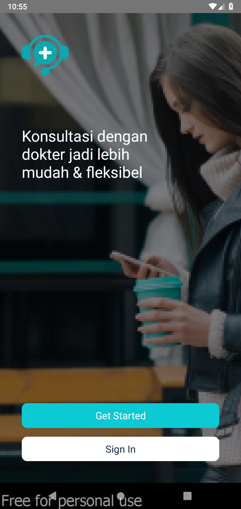
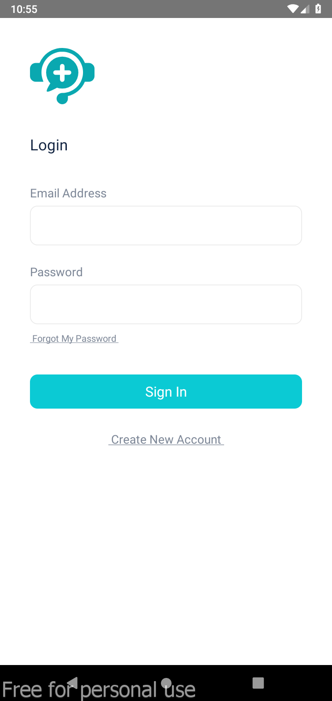
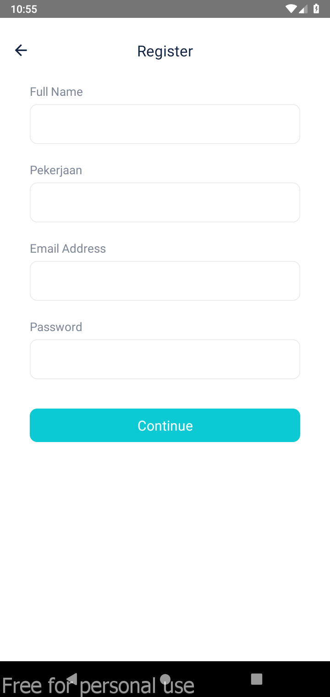
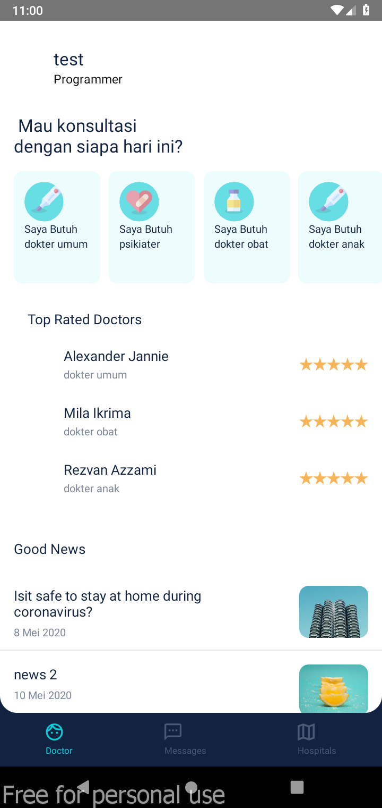
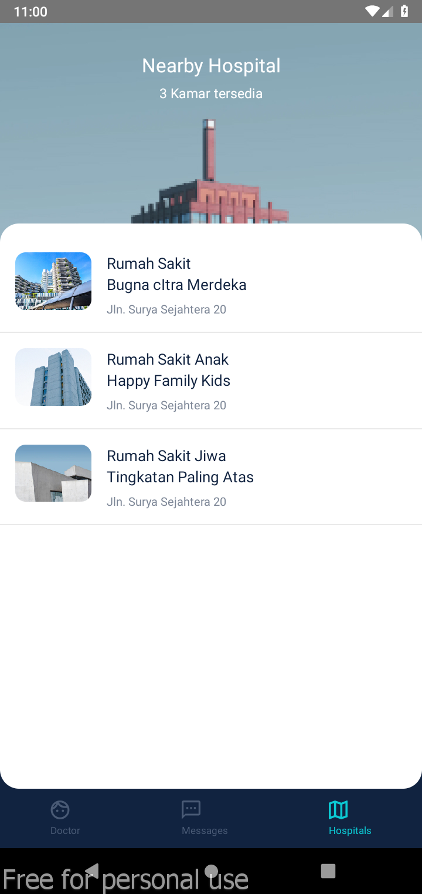
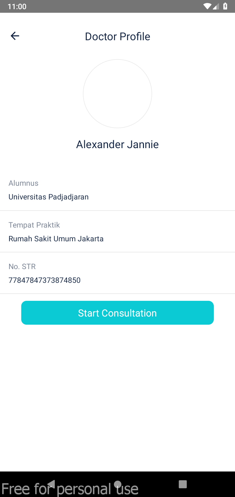
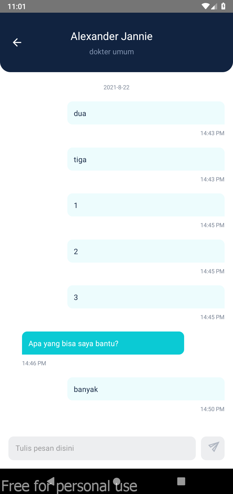

# Doctor Consultation - Patient App

Simple app using react native for consulation

## Installation

1. Clone app
2. Change firebase credential in `src/config/Fire.index.js`
3. Run the project

## Library

1. Firebase Authentication
2. Firebase Realtime Database

## Screenshot

